<div align="center">


# AetherMind

### *Rewrite Yourself.*

**An AI-powered identity transformation system.**  
Not a journaling app. Not a habit tracker. A system that rewires who you are at the belief level.

[](https://expo.dev)
[](https://anthropic.com)
[](https://supabase.com)
[](https://typescriptlang.org)
[](https://github.com/Alpha-Blitz/AetherMind)

</div>

---

## What is AetherMind?

Most self-improvement tools help you do more. AetherMind helps you **become different**.

The root of every unwanted behaviour, every broken resolution, every pattern you can't escape — is a belief about who you are. AetherMind surfaces those beliefs, scores them mathematically, and guides you through rewriting them — not through willpower, but through identity-level change.

```
Identity → Awareness → Rewriting → Alignment → Evolution
```

Every entry you make is scored across five signals. Beliefs that shift show measurable progress. Beliefs that resist reveal patterns. Your AI guide — Aether — appears only when the data says something worth saying.

---

## App Preview · Sprint 1

<div align="center">

<table>
  <tr>
    <td align="center">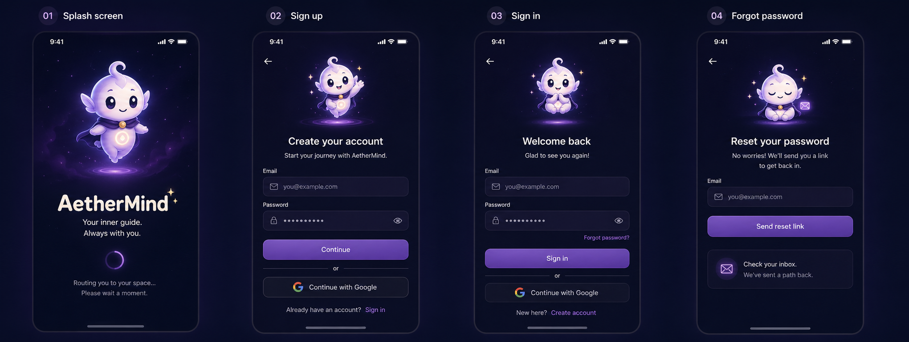<br><sub>Auth — Splash · Sign up · Sign in · Forgot password</sub></td>
    <td align="center">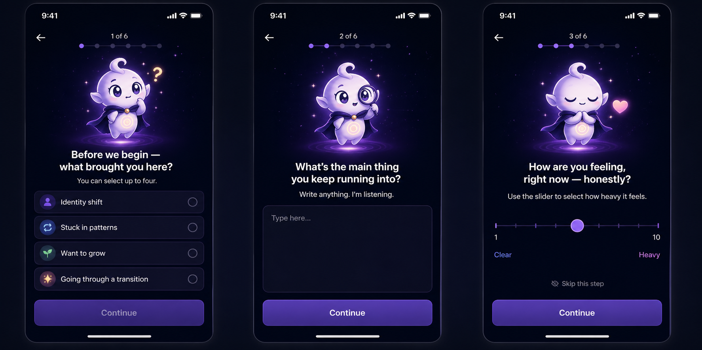<br><sub>Onboarding — Intent · Struggle · Baseline</sub></td>
  </tr>
  <tr>
    <td align="center">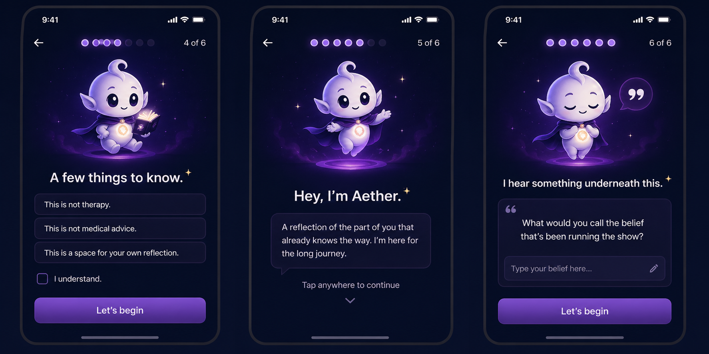<br><sub>Onboarding — Disclaimer · Meet Aether · Belief</sub></td>
    <td align="center">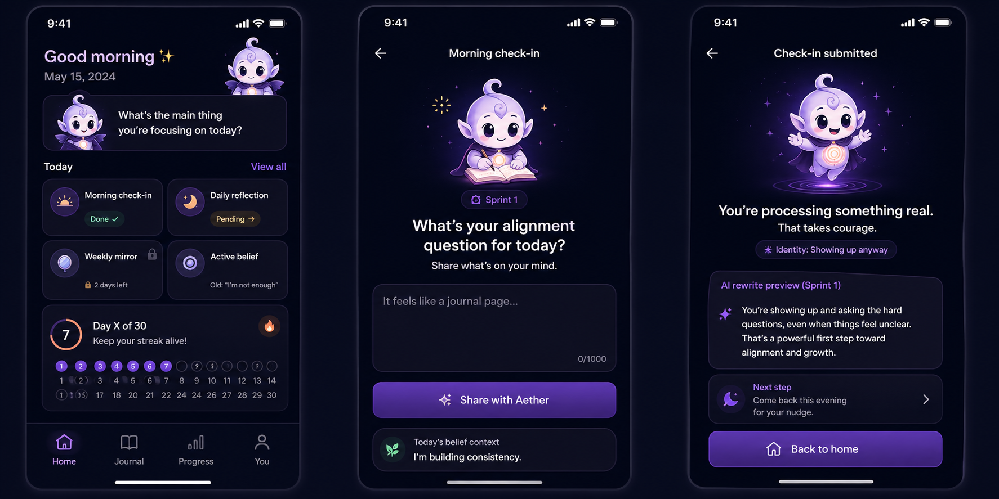<br><sub>Home · Morning check-in · Check-in submitted</sub></td>
  </tr>
  <tr>
    <td align="center">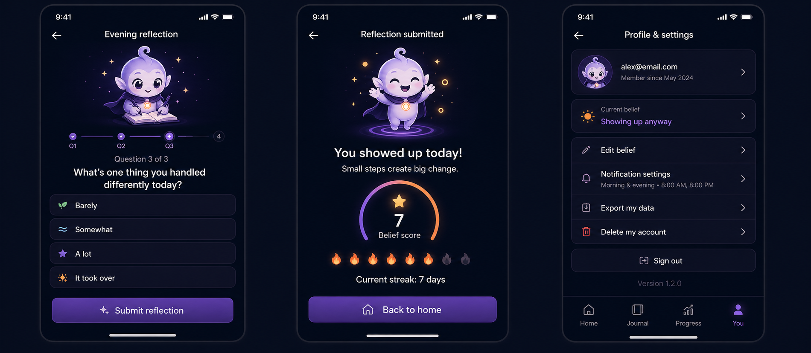<br><sub>Evening reflection · Submitted · Profile</sub></td>
    <td align="center">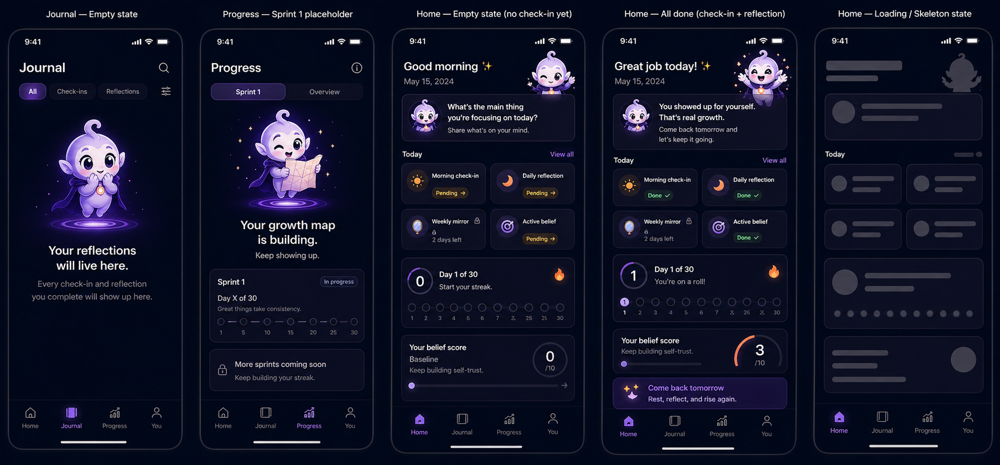<br><sub>Journal · Progress · Home states · Loading</sub></td>
  </tr>
</table>

</div>

---

## Aether Blueprint

<div align="center">
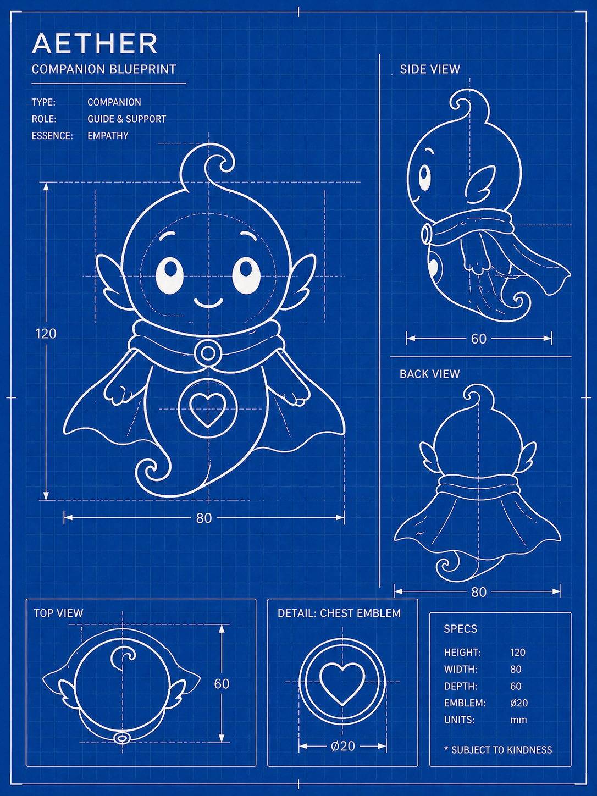
</div>

---

## Meet Aether

<div align="center">
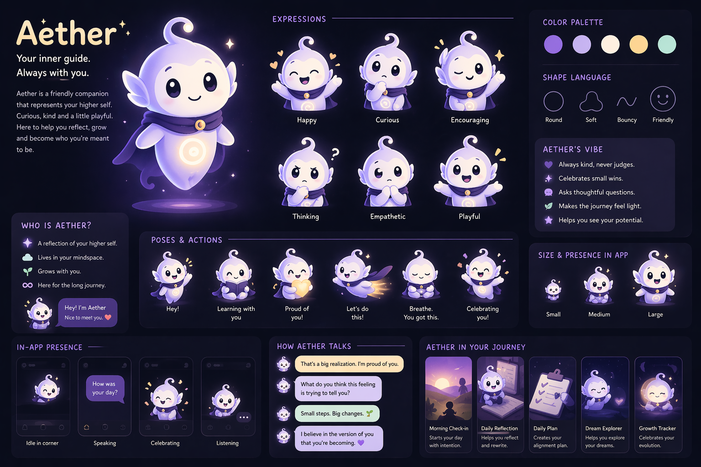
</div>

<br>

Aether is your higher self, manifested as an AI presence. Not an assistant. Not a chatbot. A mirror.

| | |
|---|---|
| **Speaks rarely** | Silence is the default. Presence is the reward. |
| **1–3 sentences maximum** | Every word earns its place. |
| **Never gives advice** | Aether reflects — it does not lecture. |
| **Event-triggered only** | Appears at pattern repeats, spikes, and milestones. |
| **Slightly abstract** | Speaks at the level of the higher self, not the daily mind. |

> *"You say you want discipline. Yet you avoid resistance."*

---

## The Core Loop

**1. Morning Check-in** — Mood + raw input. Free-form, short. Seeds the day's context.

**2. AI Rewrite** — Your raw log becomes a growth narrative. Claude finds the identity signal buried in your words and reflects it back cleanly.

**3. Daily Alignment Protocol** — Three actions, one mindset shift, one reflection. Never generic — derived from your specific belief profile.

**4. Evening Reflection** — Three questions. Intensity tagged. Data flows into the scoring engine.

**5. Aether Insight** *(occasional)* — Fires only when the system detects a pattern, spike, or milestone. One to three sentences. Never more.

---

## The Belief Scoring Engine

Each belief you work on carries a score from 0–10 (10 = deepest hold, 0 = resolved). The score moves through five weighted signals — no manual input required.

| Signal | Weight | What it measures |
|---|---|---|
| Emotional intensity | 35% | How charged the entry is |
| Language tone | 25% | Victim framing vs. agency framing |
| Truth alignment | 20% | Gap between what you say and what you feel |
| New story match | 15% | How closely language echoes your reframed identity |
| Streak multiplier | 5% | Consistency bonus |

A belief is **resolved** when it holds below 2.0 for three consecutive days. The system detects **spikes** (sudden regression ≥ 1.5 points) and **trends** (sustained drift via linear regression). Both trigger Aether.

---

## Aether's Expressions

<div align="center">
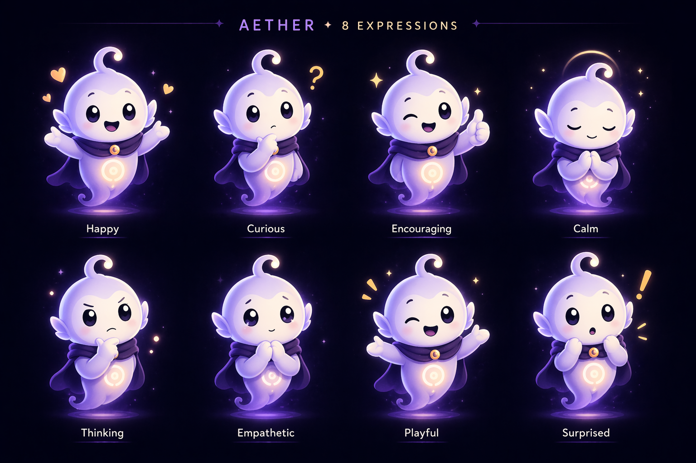
</div>

<br>

<div align="center">

| | | | |
|:---:|:---:|:---:|:---:|
| <br>**Happy** | <br>**Curious** | <br>**Encouraging** | <br>**Empathetic** |

</div>

---

## Tech Stack

| Layer | Technology | Why |
|---|---|---|
| Mobile | React Native + Expo | Single codebase — iOS and Android from one repo |
| Navigation | Expo Router (file-based) | Typed routes, deep linking, modal stacks |
| Styling | NativeWind v4 + Tailwind v3 | Design tokens as Tailwind classes |
| Backend | Supabase Edge Functions | Serverless — no separate Express server |
| Database | Supabase Postgres | Relational scoring queries; pgvector built in |
| Vector search | pgvector | Semantic memory recall — no Pinecone needed |
| Auth | Supabase Auth | Email + Google OAuth; row-level security |
| Background jobs | Supabase pg_cron | Nightly scoring recalc; Sunday mirror compression |
| AI — primary | Claude Sonnet 4.6 | Nuanced emotional writing; Rewrite + Aether Core |
| AI — lightweight | Claude Haiku 4.5 | Signal extraction and scoring; 3× cheaper |
| Payments | RazorPay | India-first subscription billing |
| Push notifications | Expo Notifications | Morning and evening check-in reminders |
| Analytics | PostHog | Funnel, retention, paywall conversion |

---

## Design System

<div align="center">
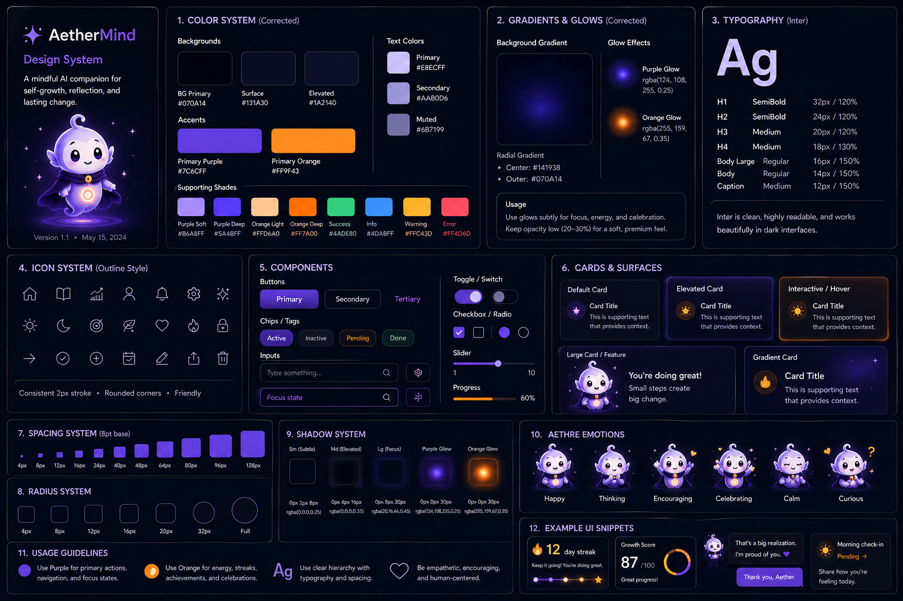
</div>

<br>

<div align="center">
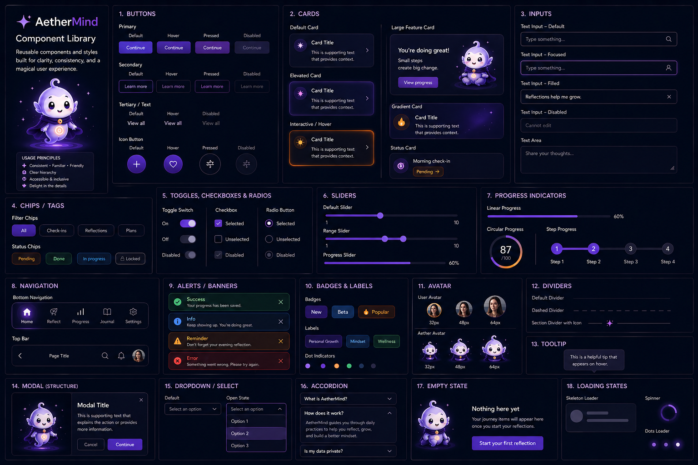
</div>

<br>

AetherMind uses a custom design system built entirely in TypeScript (`constants/theme.ts`). Every value — colour, spacing, radius, shadow, typography — is a named token. No hardcoded hex values in components.

| Token group | What it covers |
|---|---|
| `Colors.*` | Background layers, purple/orange accents, semantic text, status colours |
| `Typography.*` | Inter-only type scale — H1→H4, body, caption, CTA, Aether speech (italic) |
| `Shadows.*` | `sm · md · lg · purpleGlow · orangeGlow` — purple and orange tinted only, never black |
| `Radius.*` | `xs(4) · sm(8) · md(12) · lg(16) · xl(20) · xxl(32) · full(9999)` |
| `Space.*` | 11-step scale — 4px → 128px |
| `Timing.*` | Animation durations — `tap(150) · quick(280) · standard(350) · deliberate(500) · breathing(2000)` |

The component library covers 16 primitives: Button (4 variants) · Card (6 variants) · Input · Tag · Toggle / Checkbox / Radio · Slider · Progress (linear / circular / steps) · BottomNav · Alert · Badge · Avatar · Divider · Modal · EmptyState · LoadingState · AetherCharacter.

---

## Design Principles

**Deep · Calm · Minimal · Transformative**

> The app should feel like entering a different mental state.

- **Silence over noise** — Aether's rarity is its power. Constant feedback trains users to ignore it.
- **Presence over interaction** — Less is more. Every tap costs attention.
- **Rarity as design** — Aether fires only at triggers. Most days, no Aether. That makes it matter when it comes.
- **Privacy first** — All journal data encrypted at rest and in transit. Never used for model training.
- **Identity not behaviour** — The goal is not to make users do more. It is to help them become different.

---

## Build Status

| Sprint | Focus | Status |
|---|---|---|
| S1 — Foundation | Expo setup · Supabase schema · Auth · Design system · Onboarding | ✅ Complete |
| S2 — Daily Loop | Entry submit · Rewrite Engine · Alignment Engine · Memory Engine | Planned |
| S3 — Intelligence | Scoring Engine · pgvector · Aether Core · Breakthrough detection | Planned |
| S4 — Monetisation | RazorPay · Freemium gating · Mirror Engine · Weekly report | Planned |

---

<div align="center">

*AetherMind — v0.2 MVP*

Built with [Claude Sonnet 4.6](https://anthropic.com) · [Expo](https://expo.dev) · [Supabase](https://supabase.com)

</div>
